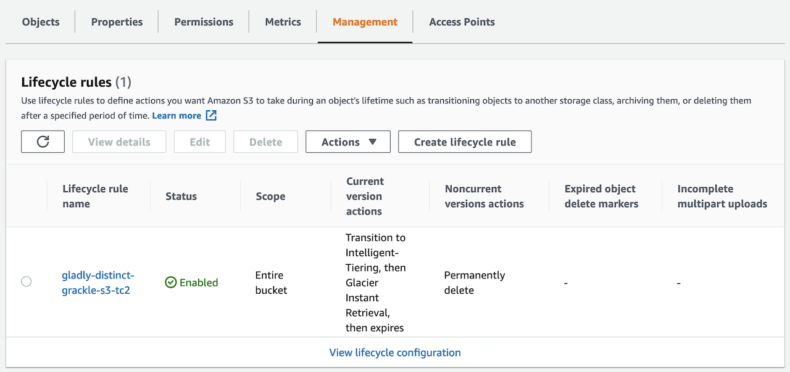

[[English](README.md)] [[한국어](README.ko.md)]

# SageMaker Blueprint
Amazon SageMaker Studio is the first fully integrated development environment (IDE) for machine learning (ML). With a single click, data scientists and developers can quickly spin up Amazon SageMaker Studio Notebooks for exploring datasets and building models. With the new ability to launch Amazon SageMaker Studio in your Amazon Virtual Private Cloud (Amazon VPC), you can control the data flow from your Amazon SageMaker Studio notebooks. This allows you to restrict internet access, monitor and inspect traffic using standard AWS networking and security capabilities, and connect to other AWS resources through AWS PrivateLink or VPC endpoints.

This is SageMaker Blueprint example helps you compose complete SageMaker clusters that are fully bootstrapped with the operational software that is needed to deploy and operate ML workloads. With this SageMaker Blueprint example, you describe the configuration for the desired state of your ML developemnt environment, such as the control plane, worker nodes, private secure network as an Infrastructure as Code (IaC) template/blueprint. Once a blueprint is configured, you can use it to stamp out consistent environments across multiple AWS accounts and Regions using your automation workflow tool, such as Jenkins, CodePipeline. SageMaker Blueprint also helps you implement relevant security controls needed to operate workloads from multiple teams in the same cluster.

## Setup
### Download
Download this example on your workspace
```
git clone https://github.com/Young-ook/terraform-aws-sagemaker
cd terraform-aws-sagemaker/examples/blueprint
```

Then you are in **blueprint** directory under your current workspace. There is an exmaple that shows how to use terraform configurations to create and manage an SageMaker and utilities on your AWS account. Check out and apply it using terraform command. If you don't have the terraform tools in your environment, go to the main [page](https://github.com/Young-ook/terraform-aws-sagemaker) of this repository and follow the installation instructions before you move to the next step.

Run terraform:
```
terraform init
terraform apply
```
Also you can use the *-var-file* option for customized paramters when you run the terraform plan/apply command.
```
terraform plan -var-file fixture.tc1.tfvars
terraform apply -var-file fixture.tc1.tfvars
```

## Storage
Amazon S3 (Simple Storage Service) is an object storage service that offers industry-leading scalability, data availability, security, and performance. In this blueprint, you use an s3 bucket for machine learning datas. And you can utilize s3 lifecycle configuration to enable intelligent-tiering that switches storage classes automatically based on object access pattern. This is important because it is easist way to reduce the storage cost of large volume datas for mahcine learning workloads.



## Applications
- [Huggingface](./apps/README.md#huggingface-transformers-with-amazon-sagemaker)
- [Personalize](./apps/README.md#amazon-personalize)

## Clean up
Before you destroy the SageMaker Studio, make sure that users in the SageMaker are deleted. Repeat the following steps for each user in the **User name** list on SageMaker control panel.
1. Choose the user.
2. On the User Details page, for each non-failed app in the Apps list, choose Delete app.
3. On the Delete app dialog, choose Yes, delete app, type delete in the confirmation field, and then choose Delete.
4. When the Status for all apps show as Deleted, choose Delete user.

If you run SageMaker Studio, don't forget you have to delete users (profiles) before you destroy the SageMaker Studio. For more the details, please refer to [this](https://docs.aws.amazon.com/sagemaker/latest/dg/gs-studio-delete-domain.html).

Run terraform:
```
terraform destroy
```
**[DON'T FORGET]** You have to use the *-var-file* option when you run terraform destroy command to delete the aws resources created with extra variable files.
```
terraform destroy -var-file fixture.tc1.tfvars
```

# Additional Resources
## Amazon EFS
- [Mount an EFS file system to an Amazon SageMaker notebook](https://aws.amazon.com/blogs/machine-learning/mount-an-efs-file-system-to-an-amazon-sagemaker-notebook-with-lifecycle-configurations/)

## Amazon SageMaker
- [Securing Amazon SageMaker Studio connectivity using a private VPC](https://aws.amazon.com/ko/blogs/machine-learning/securing-amazon-sagemaker-studio-connectivity-using-a-private-vpc/)
- [Building secure Amazon SageMaker access URLs with AWS Service Catalog](https://aws.amazon.com/blogs/mt/building-secure-amazon-sagemaker-access-urls-with-aws-service-catalog/)
- [Secure multi-account model deployment with Amazon SageMaker: Part 1](https://aws.amazon.com/blogs/machine-learning/part-1-secure-multi-account-model-deployment-with-amazon-sagemaker/)
- [Secure multi-account model deployment with Amazon SageMaker: Part 2](https://aws.amazon.com/blogs/machine-learning/part-2-secure-multi-account-model-deployment-with-amazon-sagemaker/)
- [Hybrid-network Architecture with AWS Transit Gateway](https://github.com/Young-ook/terraform-aws-sagemaker/blob/main/examples/tgw)
- [Huggingface with Amazon SageMaker](https://github.com/Young-ook/terraform-aws-sagemaker/blob/main/examples/huggingface)
