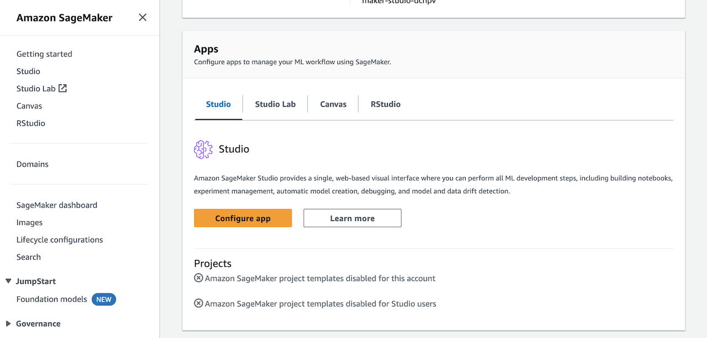
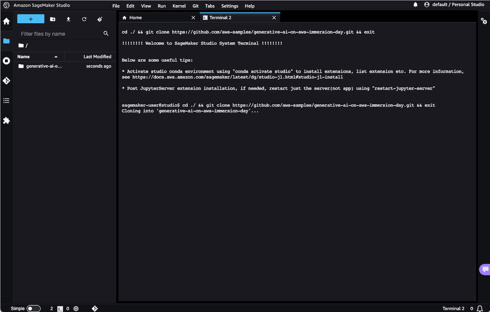

[[English](README.md)] [[한국어](README.ko.md)]

# 애플리케이션
## Amazon SageMaker에서 허깅페이스 트랜스포머(Huggingface Transformers) 사용하기
SageMaker 노트북 인스턴스가 구동되었다면, 여러 분은 AWS 관리 콘솔의 SageMaker 서비스 페이지에서 JupyterLab 또는 Jupyter notebook을 열고 접속할 수 있습니다. 이 예제에서는 Amazon SageMaker에서 처음으로 허깅페이스 트랜스포머 예제를 실행할 때 필요한 자원을 모두 배포할 것입니다. 먼저 아래와 같이 저장소를 여러 분의 노트북 작업환경에 복사합니다. 이제 여러 분은 보다 예제 노트북에 접근할 수 있습니다.

## Amazon Personalize
[Amazon Personalize](https://aws.amazon.com/personalize/)는 기계 학습에 대한 전문지식 없더라도 Amazon.com의 실시간 개인화 추천에서 사용하는 기계 학습과 같은 기계 학습 기반의 애플리케이션을 만들 수 있도록 해 줍니다.

Amazon Personalize를 사용하면 개발자가 특정 제품 추천, 개인화된 제품 순위 재지정, 맞춤형 다이렉트 마케팅 등 다양한 개인화 경험을 제공할 수 있는 애플리케이션을 쉽게 구축할 수 있습니다. Amazon Personalize는 엄격한 정적 규칙 기반 추천 시스템을 넘어 사용자 지정 ML 모델을 교육, 조정 및 배포하여 소매, 미디어 및 엔터테인먼트와 같은 업계의 고객에게 고도로 맞춤화된 추천을 제공하는 완전 관리형 기계 학습 서비스입니다.
SageMaker 노트북 인스턴스가 시작된 후 AWS 관리 콘솔의 SageMaker 서비스 페이지에서 JupyterLab 또는 Jupyter 노트북을 열고 접속할 수 있습니다. 다음은 Amazon Personalize로 첫 번째 캠페인을 구축하는 데 필요한 모든 리소스를 배포하는 이 예입니다. 제공된 노트북은 자체 데이터로 자체 모델을 구축하기 위한 템플릿 역할도 할 수 있습니다. 이 저장소는 여러 분의 실행 환경에 복제되므로 이 접근 방식을 통하여 추가적인 고급 노트북 탐색도 할 수 있습니다. 이 자습서에서는 Amazon Personalize를 사용하여 사용자 지정 데이터 세트, 모델 및 추천 캠페인을 생성하기 위한 환경 구축 과정을 안내합니다. 아래 단계에서는 자체 추천 모델을 구축하고 개선한 다음 모든 리소스를 정리하여 원치 않는 요금이 발생하지 않도록 하는 프로세스를 간략하게 설명합니다. 이제 실습을 수행하려면 아래의 순서를 따라하시길 바랍니다.

1. `1.Building_Your_First_Campaign.ipynb` - Guides you through building your first campaign and recommendation algorithm.
2. `2.View_Campaign_And_Interactions.ipynb` - Showcase how to generate a recommendation and how to modify it with real time intent.
3. `Cleanup.ipynb` - Deletes anything that was created so you are not charged for additional resources.

여러 분은 /notebooks 폴더에서 Jupyter 노트북을 다운로드할 수 있습니다. 여기에 있는 실습이 오래 되었거나 잘 동작하지 않는다면 [원본 저장소](https://github.com/aws-samples/amazon-personalize-samples)를 방문하여 업데이트를 확인하십시오.

실습을 마치면 AWS 리소스를 정리해야 합니다. 'Cleanup.ipynb' 노트북의 지침에 따라 SageMaker 노트북을 통해 만든 리소스를 제거합니다. 그런 다음 SageMaker 및 AWS 인프라스트럭처를 삭제할 수 있습니다.

## 점프스타트 (JumpStart)
Amazon SageMaker JumpStart는 ML 여정을 가속화하는 데 도움이 될 수 있는 기계 학습(ML) 허브입니다. SageMaker JumpStart를 사용하면 모델 허브에서 사전 훈련된 모델이 포함된 기본 제공 알고리즘에 액세스하여 사전 훈련된 기초 모델로 문서 요약 및 이미지 생성과 같은 태스크를 수행하고 사전 구축된 솔루션으로 일반적인 사용 사례를 해결할 수 있습니다. 또한 ML 모델 및 노트북을 포함한 ML 아티팩트를 조직 내에서 공유하여 ML 모델 구축 및 배포를 가속화할 수 있습니다. 보다 자세한 내용은 [Amazon SageMaker JumpStart](https://aws.amazon.com/ko/sagemaker/jumpstart/) 웹사이트를 참고하시기 바랍니다.

만약, SageMaker를 처음 사용한다면, 다음과 같은 오류 메시지를 볼 수 있다. 이럴 경우 JumpStart를 사용하도록 설정을 활성화 해주어야 한다.

## 생성형 인공지능 예제 (Generative AI on AWS)
생성형 인공지능을 직접 실습해 볼 수 있는 예제입니다. 먼저, SageMaker Studio를 실행합니다. AWS 관리콘솔에서 SageMaker Studio 앱을 띄웁니다. SageMaker Studio의 왼쪽 내비게이션 메뉴에서 소스 콘트롤 버튼을 누릅니다. 이제, *Clone a repository* 단추를 누르면, 여러 예제 소스 저장소 중에서 내려받기할 곳을 정할 수 있는 팝업 다이알로그가 나타날 것입니다.

# 추가 정보
## Amazon SageMaker
- [Amazon SageMaker JumpStart로 사전 구축된 모델과 기계 학습 솔루션 액세스 단순화](https://aws.amazon.com/ko/blogs/korea/amazon-sagemaker-jumpstart-simplifies-access-to-prebuilt-models-and-machine-learning-models/)
- [개인화된 IAM 역할을 활용한 Amazon SageMaker JumpStart 활성화](https://aws.amazon.com/blogs/machine-learning/enable-amazon-sagemaker-jumpstart-for-custom-iam-execution-roles/)
- [생성형 인공지능 이머전데이 워크샵](https://github.com/aws-samples/generative-ai-on-aws-immersion-day)

## Amazon Personalize
- [기계학습을 활용하여 개인화된 경험 유지하기](https://github.com/aws-solutions/maintaining-personalized-experiences-with-machine-learning)
- [Amazon Personalize 예제](https://github.com/aws-samples/amazon-personalize-samples)
- [Amazon Personalize 개발자 문서](https://docs.aws.amazon.com/personalize/latest/dg/what-is-personalize.html)
- [Omnichannel personalization with Amazon Personalize](https://aws.amazon.com/blogs/machine-learning/omnichannel-personalization-with-amazon-personalize/)
- [Introducing recommendation scores in Amazon Personalize](https://aws.amazon.com/blogs/machine-learning/introducing-recommendation-scores-in-amazon-personalize/)
