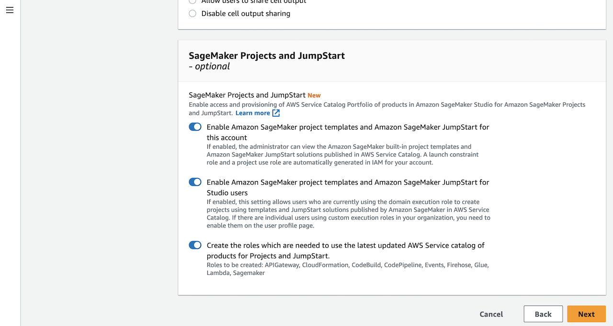
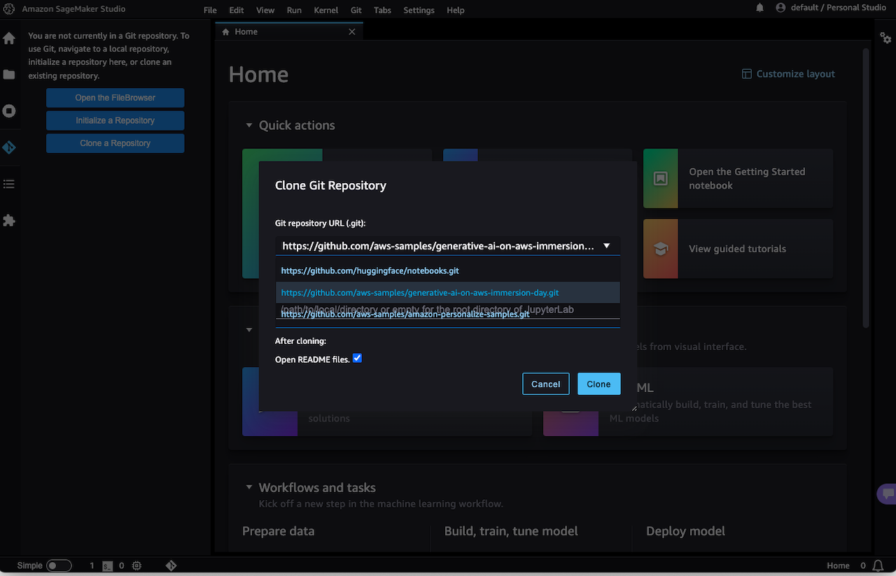

[[English](README.md)] [[한국어](README.ko.md)]

# Applications
## Huggingface Transformers with Amazon SageMaker
After a SageMaker notebook instance is launched, you can access and open a JupyterLab or Jupyter notebook in the sagemaker service page of AWS management console. This example that will deploy all the resources you need to run your first hugging face transformers example with Amazon SageMaker. This repository is cloned into the environment so you can explore the more advanced notebooks with this approach as well.

## Amazon Personalize
[Amazon Personalize](https://aws.amazon.com/personalize/) enables developers to build applications with the same machine learning (ML) technology used by Amazon.com for real-time personalized recommendations – no ML expertise required.

Amazon Personalize makes it easy for developers to build applications capable of delivering a wide array of personalization experiences, including specific product recommendations, personalized product re-ranking, and customized direct marketing. Amazon Personalize is a fully managed machine learning service that goes beyond rigid static rule based recommendation systems and trains, tunes, and deploys custom ML models to deliver highly customized recommendations to customers across industries such as retail and media and entertainment.

After a SageMaker notebook instance is launched, you can access and open a JupyterLab or Jupyter notebook in the sagemaker service page of AWS management console. This example that will deploy all the resources you need to build your first campaign with Amazon Personalize. The notebooks provided can also serve as a template to building your own models with your own data. This repository is cloned into the environment so you can explore the more advanced notebooks with this approach as well.

This tutorial will walk you through building an environment to create a custom dataset, model, and recommendation campaign with Amazon Personalize. The steps below outline the process of building your own recommendation model, improving it, and then cleaning up all of your resources to prevent any unwanted charges. To get started executing these follow the steps in the next section.

1. `1.Building_Your_First_Campaign.ipynb` - Guides you through building your first campaign and recommendation algorithm.
2. `2.View_Campaign_And_Interactions.ipynb` - Showcase how to generate a recommendation and how to modify it with real time intent.
3. `Cleanup.ipynb` - Deletes anything that was created so you are not charged for additional resources.

You can download the Jupyter notebooks from the /notebooks folder. If you have any issues with any of the content here please visit the original [repo](https://github.com/aws-samples/amazon-personalize-samples) for updates.

Whne you finishied the hands-on lab, you have to clean up AWS resources. Follow the instructions of `Cleanup.ipynb` notebook to purge the resource that we made through SageMaker notebook. Then, you can try to destroy SageMaker and AWS infrastructure.

## JumpStart
Amazon SageMaker JumpStart is a machine learning (ML) hub that can help you accelerate your ML journey. With SageMaker JumpStart, you can access pretrained models, including foundation models, to perform tasks like article summarization and image generation. Pretrained models are fully customizable for your use case with your data, and you can easily deploy them into production with the user interface or SDK. In addition, you can access prebuilt solutions to solve common use cases, and share ML artifacts, including ML models and notebooks, within your organization to accelerate ML model building and deployment. For more details, please visit this [developer guide for SageMaker JumpStart](https://docs.aws.amazon.com/sagemaker/latest/dg/studio-jumpstart.html).

If it is the your first time to run SageMaker, you may see the error messages below. To use JumpStart in your SageMaker, you have to enable.

## Generative AI on AWS
This is a hands-on lab sample for Gen-AI on AWS workshop. You can run this example on your SageMaker Studio. Launch your SageMaker Studio app in AWS Console. And click the source control button on the left navigation at the SageMaker Studio to manage code repositories. And you can see a pop up dialog that displays code repositories you can add to your SageMaker when you click the *Clone a repository* button.

# Additional Resources
## Amazon SageMaker
- [Amazon SageMaker JumpStart Simplifies Access to Pre-built Models and Machine Learning Solutions](https://aws.amazon.com/blogs/aws/amazon-sagemaker-jumpstart-simplifies-access-to-prebuilt-models-and-machine-learning-models/)
- [Enable Amazon SageMaker JumpStart for custom IAM execution roles](https://aws.amazon.com/blogs/machine-learning/enable-amazon-sagemaker-jumpstart-for-custom-iam-execution-roles/)
- [Generative AI on AWS Immersion Day](https://github.com/aws-samples/generative-ai-on-aws-immersion-day)

## Amazon Personalize
- [Maintaining Personalized Experiences with Machine Learning](https://github.com/aws-solutions/maintaining-personalized-experiences-with-machine-learning)
- [Amazon Personalize Samples](https://github.com/aws-samples/amazon-personalize-samples)
- [Amazon Personalize Developer Guide](https://docs.aws.amazon.com/personalize/latest/dg/what-is-personalize.html)
- [Omnichannel personalization with Amazon Personalize](https://aws.amazon.com/blogs/machine-learning/omnichannel-personalization-with-amazon-personalize/)
- [Introducing recommendation scores in Amazon Personalize](https://aws.amazon.com/blogs/machine-learning/introducing-recommendation-scores-in-amazon-personalize/)
