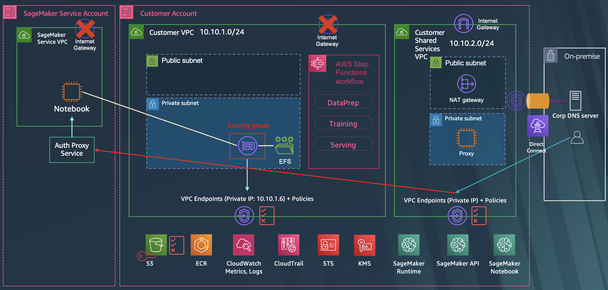

# Hybrid-Cloud for Financial Service Industry



## Setup
This is an example that shows how to configure Hybrid network and deploy SageMaker service in your isolated network. Check out and apply it using terraform command. First we have to create two VPCs. One is an isolated vpc to place the sagemaker notebook instance, and the other is a control tower vpc to simulate a corporate data center.

Run terraform:
```
terraform init
terraform apply -target module.vpc -target module.corp
```
Also you can use the *-var-file* option for customized paramters when you run the terraform plan/apply command.
```
terraform plan -var-file tc1.tfvars -target module.vpc -target module.corp
terraform apply -var-file tc1.tfvars -target module.vpc -target module.corp
```

Run terraform to create other resources:
```
terraform apply
```

## Clean up
Run terraform:
```
terraform destroy
```
**[DON'T FORGET]** You have to use the *-var-file* option when you run terraform destroy command to delete the aws resources created with extra variable files.
```
terraform destroy -var-file tc1.tfvars
```
