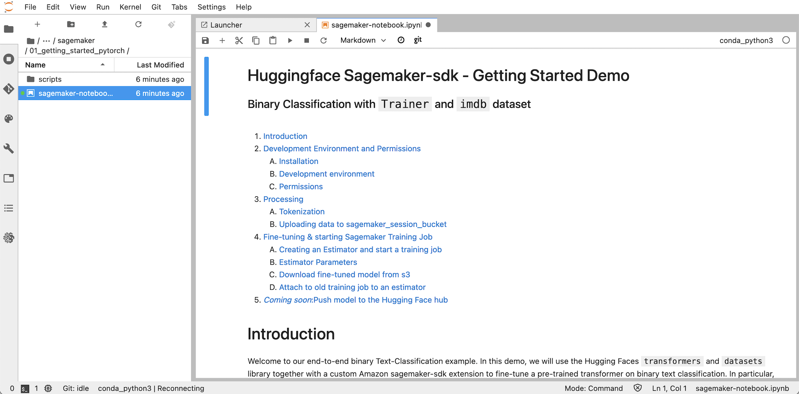

# Huggingface Transformers with Amazon SageMaker
[Amazon SageMaker](https://aws.amazon.com/pm/sagemaker) helps data scientists and developers to prepare, build, train, and deploy high-quality machine learning models quickly by bringing together a broad set of capabilities purpose-built for machine learning.

## Setup
[This](https://github.com/Young-ook/terraform-aws-sagemaker/blob/main/examples/huggingface/main.tf) is the example of terraform configuration file to create SageMaker notebook on AWS. Check out and apply it using terraform command.

Run terraform:
```
terraform init
terraform apply
```
Also you can use the `-var-file` option for customized paramters when you run the terraform plan/apply command.
```
terraform plan -var-file tc1.tfvars
terraform apply -var-file tc1.tfvars
```

## Getting started
After a SageMaker notebook instance is launched, you can access and open a JupyterLab or Jupyter notebook in the sagemaker service page of AWS management console. This example that will deploy all the resources you need to run your first hugging face transformers example with Amazon SageMaker. This repository is cloned into the environment so you can explore the more advanced notebooks with this approach as well.



## Clean up
If you run this hands-on lab on SageMaker Studio, don't forget you have to delete users (profiles) before you destroy the SageMaker Studio. For more the details, please refer to [this](https://docs.aws.amazon.com/sagemaker/latest/dg/gs-studio-delete-domain.html).

Next, follow the instruction of `Cleanup.ipynb` notebook to purge the resource that we made through SageMaker notebook. Then, run terraform destroy command to delete infrastructure:
```
terraform destroy
```

Don't forget you have to use the `-var-file` option when you run terraform destroy command to delete the aws resources created with extra variable files.
```
terraform destroy -var-file tc1.tfvars
```
