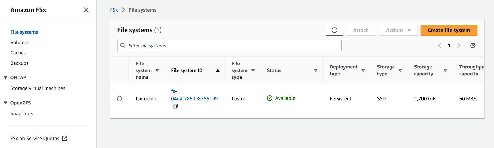

# Amazon FSx for Lustre
[Lustre](https://www.lustre.org/) filesystem is an open-source, parallel file system that supports many requirements of leadership class HPC simulation environments. Whether you’re a member of our diverse development community or considering the Lustre file system as a parallel file system solution, these pages offer a wealth of resources and support to meet your needs. And [Amazon FSx for Lustre](https://docs.aws.amazon.com/fsx/latest/LustreGuide/what-is.html) makes it easy and cost-effective to launch and run the popular, high-performance Lustre file system on AWS. You use Lustre for workloads where speed matters, such as machine learning, high performance computing (HPC), video processing, and financial modeling.



## Getting started
### Prerequisites
This module requires terraform. If you don't have the terraform tools in your environment, go to the main [page](https://github.com/Young-ook/terraform-aws-sagemaker) of this repository and follow the installation instructions before you move to the next step.

### Setup
```hcl
module "luster" {
  source  = "Young-ook/sagemaker/aws//modules/lustre"
}
```

Run terraform:
```
terraform init
terraform apply
```
