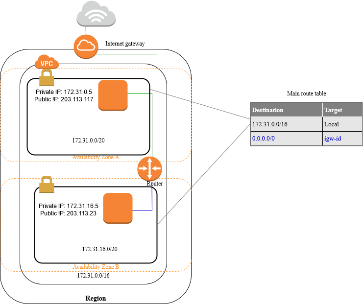

# Amazon VPC
[Amazon Virtual Private Cloud(Amazon VPC)](https://aws.amazon.com/vpc/) is a service that lets you launch AWS resources in a logically isolated virtual network that you define. You have complete control over your virtual networking environment, including selection of your own IP address range, creation of subnets, and configuration of route tables and network gateways. You can use both IPv4 and IPv6 for most resources in your virtual private cloud, helping to ensure secure and easy access to resources and applications.

## Default VPC
A default VPC is ready for you to use so that you don't have to create and configure your own VPC. A default VPC is suitable for getting started quickly, and for launching public instances such as a blog or simple website. You can modify the components of your default VPC as needed.

The following figure illustrates the key components that we set up for a default VPC


## Default subnets
By default, a default subnet is a public subnet, because the main route table sends the subnet's traffic that is destined for the internet to the internet gateway. You can make a default subnet into a private subnet by removing the route from the destination 0.0.0.0/0 to the internet gateway. However, if you do this, no EC2 instance running in that subnet can access the internet.

What is *public* subnets? - public subnets connect directly to the Internet using an Internet Gateway. If you want your instances to have a public IP address and be directly reachable from the Internet, you must place them in a public subnet. In other word, *internet-facing* subnets.

## Quickstart
### Setup

```hcl
module "vpc" {
  source = "Young-ook/sagemaker/aws//modules/vpc"
}
```

Run terraform:
```
terraform init
terraform apply
```
